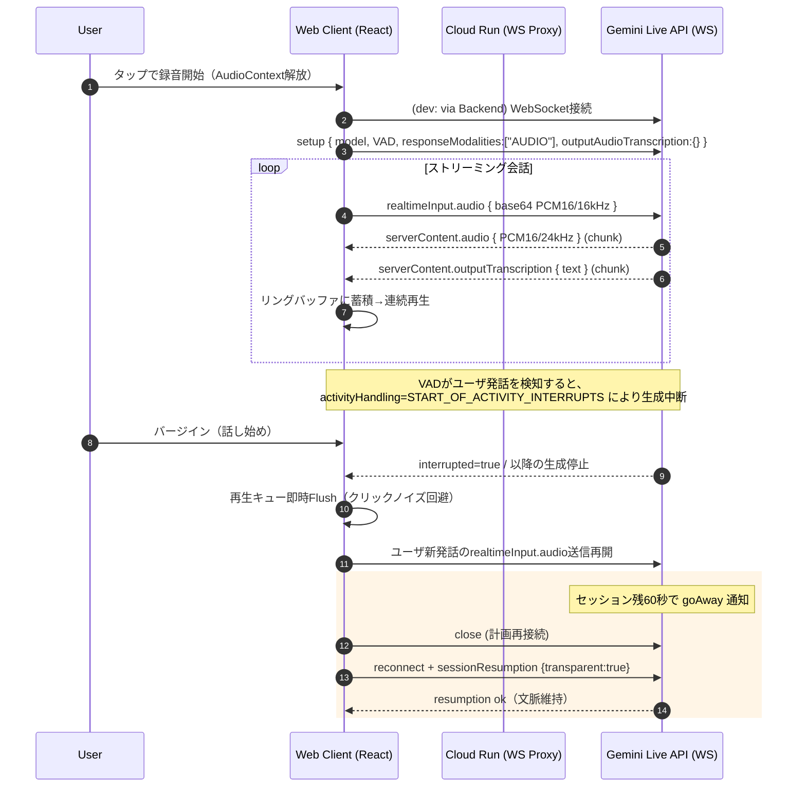
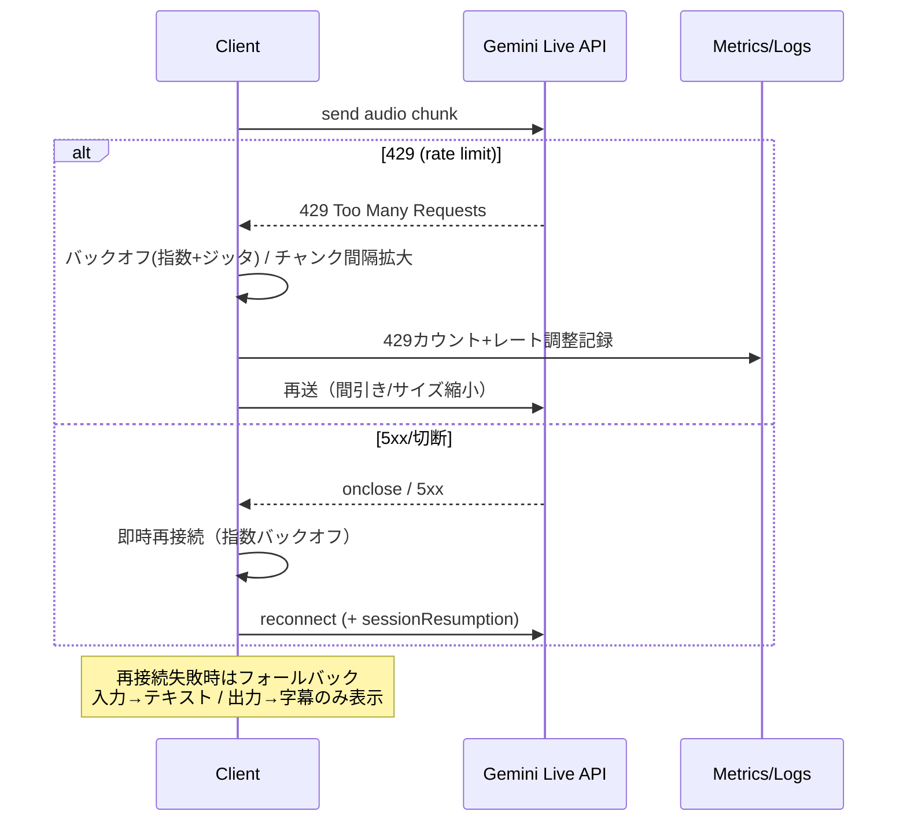

# Cloud Run 構成定義書 (音声対話Webアプリ / v4.0 / 2025-09-16)

---

## 6. Cloud Run設定（MVP）

| 項目          | 値                         |
| ----------- | ------------------------- |
| リージョン       | `asia-northeast1`         |
| vCPU/メモリ    | 1 vCPU / 1GB              |
| concurrency | **1**                     |
| タイムアウト      | 3600s                     |
| min/max     | min=1 / max=3             |
| CPU割当       | on-demand（Alwaysは不要、コスト高） |

---

## 11. 非機能・運用

* **監視指標**：往復遅延、turn時間、音声欠落率、割り込み率、429発生回数
* **ログ**：WebSocketイベント、VADイベント、切断理由
* **コスト**：MVPテストで数千円規模

---

## 付録

### 構成図（アーキテクチャ）

```mermaid
graph TD
  subgraph Client["Web Client (React + Web Audio)"]
    UI[UI / Controls] --> AW[AudioWorklet (Float32→PCM16 16kHz)]
    AW --> Enc[Base64 Encoder]
    RB[Ring Buffer (24kHz Playback)] --> Out[Audio Output]
    UI -->|User Action| AC[AudioContext Unlock]
    UI --> Metrics[Client Metrics (latency, turn time)]
  end

  subgraph Backend["Cloud Run (WS Proxy / Token Server)"]
    Proxy[WS Proxy (dev)]:::ws
    Token[Ephemeral Token Server (prod)]:::sec
    Logs[Structured Logs]:::obs
  end

  subgraph Google["Gemini Live API"]
    LiveWS[wss://...BidiGenerateContent]:::ws
  end

  Mic[Mic Input] -->|getUserMedia| AW
  Enc -->|realtimeInput.audio (base64 PCM16/16kHz)| Proxy
  Proxy -->|WS| LiveWS
  LiveWS -->|serverContent (PCM16/24kHz + transcription)| Proxy
  Proxy --> RB
  RB --> Out

  UI -->|setup (model/VAD/modality)| Proxy
  Proxy --> LiveWS

  Token -. optional (prod) .-> Client
  Client -. bearer: ephemeral token .-> LiveWS

  Proxy --> Logs
  classDef ws fill:#e7f0ff,stroke:#5b8def,stroke-width:1px;
  classDef sec fill:#eafbea,stroke:#33aa55,stroke-width:1px;
  classDef obs fill:#fff4e5,stroke:#ff9900,stroke-width:1px;
```

### シーケンス図（リアルタイム対話＋割り込み）



### シーケンス図（エラー／再試行・レート制御）



---

### リスク対策（Cloud Run 関連）

* iOS Safari：ユーザ操作必須、AudioWorklet非対応環境はフォールバック  
* Cloud Run：concurrency=1設定、min=1でコールドスタート回避  
* レイテンシ：バッファ調整とモデル選択で対応
